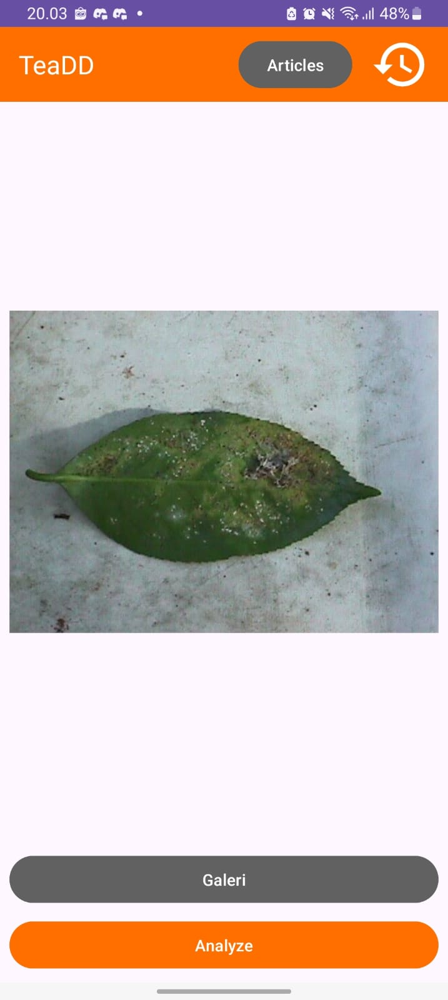
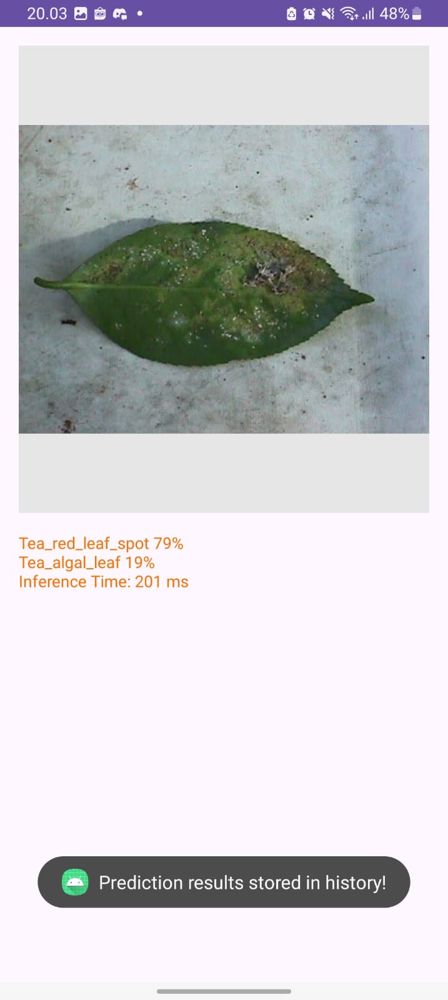
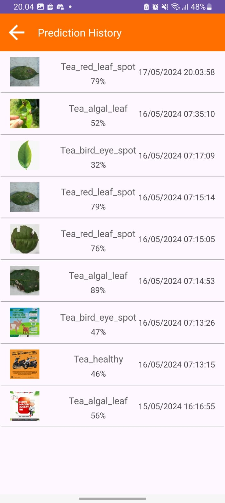

# TeaDD: Tea Disease Detection

TeaDD is an Android application developed using Kotlin that helps in detecting diseases in tea plants. The app integrates a TensorFlow Lite model to analyze and identify different tea plant diseases, providing users with an easy and efficient way to maintain healthy tea crops. It also features a history prediction and works offline, making it an **excellent starter deploy for machine learning TensorFlow Lite models into mobile apps**.

## Features

- **Disease Detection**: Detects various diseases in tea plants using an integrated TensorFlow Lite model.
- **History Prediction**: Keeps a history of previous detections and predicts potential future issues.
- **Offline Capability**: Functions without an internet connection, making it suitable for use in remote locations.

## Screenshots
| | | |
|:-------------------------:|:-------------------------:|:-------------------------:|
| Home | Inference Result | History |

## Team Members
- Furqan Al Ghifari Zulva
- Rifa Faruqi
- Ivan Chiari
- Habil Nasution
- Fanul Nastia

## Project URL
https://github.com/riparuk/TeaDD.git

## Video URL
https://youtu.be/fW96eS4r8Ug

### How to Clone This Project

To clone and run this project in Android Studio, follow these steps:

**Clone the Repository:**
- Copy the URL of this repository.
- Open Android Studio.
- Select `File` > `New` > `Project from Version Control`.
- Select `Git`.
- Paste the copied URL into the `URL` field.
- Choose the directory where you want to save the project.
- Click `Clone`.

**Sync the Project:**
- Once cloning is complete, Android Studio will prompt you to sync the project with Gradle. Click `Sync Now`.

**Additional Configuration:**
- If the project requires additional configuration (e.g., API keys or other configuration files), follow the instructions provided in the project documentation.

**Run the Project:**
- Select the device or emulator you want to use from the Android Studio toolbar.
- Click the `Run` button or use the `Shift + F10` shortcut.

---

Feel free to further adjust this template to better fit your needs!
